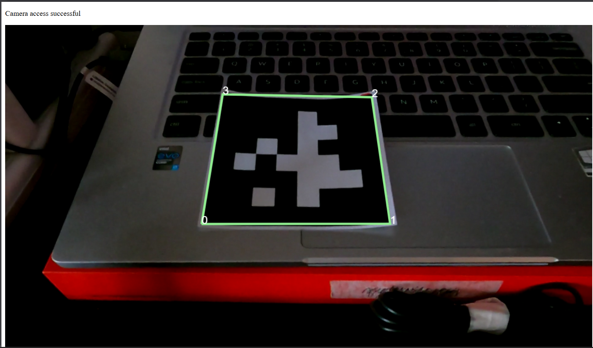

# Pointr Client Dev Doc
## Initial flow diagram


# Setup

Fork and clone the project:

```bash
git clone https://github.com/gbccsclub/pointr.git
```

Use live-server to avoid CORS problem:

```bash
npm i -g live-server
cd client
live-server --port=3000
```

# AprilTag

The AprilTag library detects the 36h11 family (can store up to $2^{11}$ possible id. Any online AprilTag generator will work just fine.

[Here's an example](https://chaitanyantr.github.io/apriltag.html) (Don't forget to select the 36h11 tag family).

# Detections

Only the first tag in the `detections` array is used for further processing before the next check.

## Detection structure

```ts
{
    id: number;
    corners: { x: number, y: number }[4];
    center: { x: number, y: number },
    pose: {
        size: number; // not sure what unit this is in
        R: number[3][]; // 3x3 rotation matrix of tag's orientation
        t: number[3]; // translation vector
        e: number; // dont know what this is
        asol: { // neither this
            R: number[3][];
            t: number[3];
            e: number;
            uniquesol: boolean;
        }
    }
}
```

The corner of the tag start from bottom-left then it count up counter-clockwise.


