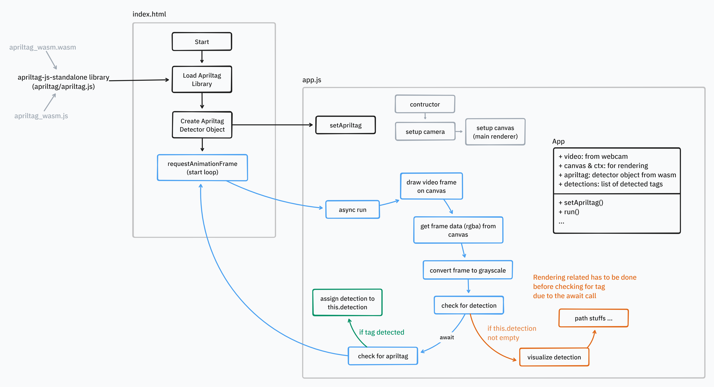

# Pointr Client Dev Doc
## Initial flow diagram



# Setup

Fork and clone the project:

```bash
git clone https://github.com/gbccsclub/pointr.git
```

Use live-server to avoid CORS problem:

```bash
npm i -g live-server
cd client
live-server --port=3000
```

Further info are under development.